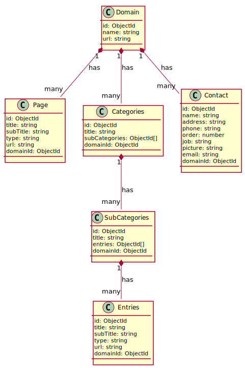

# API AYUNTAMIENTOS 2024

## Diagrama de base de datos
<!--
@startuml diagram

class Page {
    id: ObjectId
    title: string
    subTitle: string
    type: string
    url: string
    domainId: ObjectId
    isActive: boolean
}

class Domain {
    id: ObjectId
    name: string
    url: string
    isActive: boolean
}

class Entries {
    id: ObjectId
    title: string
    subTitle: string
    type: string
    url: string
    domainId: ObjectId
    isActive: boolean
}

class SubCategories {
    id: ObjectId
    title: string
    entries: ObjectId[]
    domainId: ObjectId
    isActive: boolean
}

class Categories {
    id: ObjectId
    title: string
    subCategories: ObjectId[]
    domainId: ObjectId
    isActive: boolean
}

class Contact {
    id: ObjectId
    name: string
    address: string
    phone: string
    order: number
    job: string
    picture: string
    email: string
    domainId: ObjectId
    isActive: boolean
}

Domain "1" *-- "many" Page : has
Domain "1" *-- "many" Contact : has
Domain "1" *-- "many" Categories : has
Categories "1" *-- "many" SubCategories : has
SubCategories "1" *-- "many" Entries : has


@enduml
-->



## Description

[Nest](https://github.com/nestjs/nest) framework TypeScript starter repository.

## Installation

```bash
$ npm install
```

## Running the app

```bash
# development
$ npm run start

# watch mode
$ npm run start:dev

# production mode
$ npm run start:prod
```

## Test

```bash
# unit tests
$ npm run test

# e2e tests
$ npm run test:e2e

# test coverage
$ npm run test:cov
```
